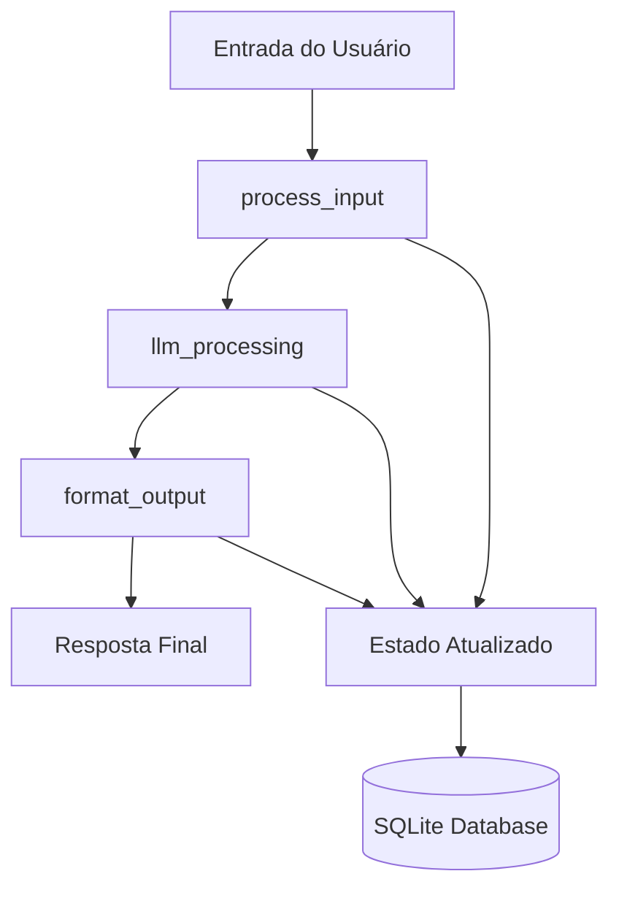

# Fase 1: Fundação LangGraph

A Fase 1 estabelece a base arquitetural do Gianna com sistema de estado unificado baseado em LangGraph, proporcionando conversações stateful e persistência automática.

## Visão Geral

### Objetivo Principal
Migrar do sistema de chains tradicionais para uma arquitetura baseada em workflows com estado persistente, mantendo total compatibilidade com o código existente.

### Componentes Implementados

#### 1. Sistema de Estado Central
```python
# gianna/core/state.py
class GiannaState(TypedDict):
    conversation: ConversationState
    audio: AudioState
    commands: CommandState
    metadata: Dict[str, Any]
```

#### 2. LangGraph Integration
```python
# gianna/core/langgraph_chain.py
class LangGraphChain(AbstractBasicChain):
    def _build_workflow(self):
        graph = StateGraph(GiannaState)
        graph.add_node("process_input", self._process_input)
        graph.add_node("llm_processing", self._llm_processing)
        graph.add_node("format_output", self._format_output)
        return graph.compile(checkpointer=self.checkpointer)
```

#### 3. Gerenciador de Estado
```python
# gianna/core/state_manager.py
class StateManager:
    def __init__(self, db_path: str = "gianna_state.db"):
        self.checkpointer = SqliteSaver.from_conn_string(str(db_path))
```

#### 4. Utilitários de Migração
```python
# gianna/core/migration_utils.py
def migrate_chain(old_chain, target_type="langgraph"):
    """Migrar chains existentes para LangGraph"""
```

---

## Arquitetura Técnica

### Fluxo de Processamento



### Estados Gerenciados

#### ConversationState
- `messages`: Histórico completo da conversação
- `session_id`: Identificador único da sessão
- `user_preferences`: Preferências personalizadas
- `context_summary`: Resumo automático do contexto

#### AudioState
- `current_mode`: Estado atual (idle, listening, speaking, processing)
- `voice_settings`: Configurações de TTS/STT
- `language`: Idioma ativo

#### CommandState
- `execution_history`: Histórico de comandos executados
- `pending_operations`: Operações aguardando execução

---

## Casos de Uso Práticos

### 1. Assistente Conversacional Básico

**Cenário**: Chatbot para site empresarial com memória de contexto.

```python
from gianna.core.langgraph_chain import LangGraphChain

# Configurar assistente
assistente = LangGraphChain(
    "gpt4",
    """Você é um assistente de atendimento da empresa XYZ.
    - Seja profissional e prestativo
    - Lembre-se do contexto da conversa
    - Ofereça soluções práticas"""
)

# Primeira interação
resp1 = assistente.invoke({
    "input": "Olá, preciso de informações sobre seus produtos"
}, session_id="cliente_001")

# Segunda interação (com contexto)
resp2 = assistente.invoke({
    "input": "Qual é o prazo de entrega?"
}, session_id="cliente_001")  # Mantém contexto
```

**Benefícios**:
- ✅ Conversações naturais e contextuais
- ✅ Memória automática entre interações
- ✅ Escalabilidade para múltiplos clientes
- ✅ Persistência entre reinicializações

---

### 2. Sistema de FAQ Inteligente

**Cenário**: Base de conhecimento que aprende com as perguntas.

```python
class FAQ_Assistant:
    def __init__(self):
        self.chain = LangGraphChain(
            "gpt35",
            """Você é um especialista em nossa base de conhecimento.
            - Responda com base nas informações fornecidas
            - Se não souber, peça esclarecimentos
            - Mantenha histórico para melhorar respostas"""
        )

    async def processar_pergunta(self, pergunta, usuario_id):
        # Buscar contexto anterior do usuário
        contexto = await self._obter_contexto(usuario_id)

        # Processar com contexto
        resposta = self.chain.invoke({
            "input": f"Contexto: {contexto}\\n\\nPergunta: {pergunta}"
        }, session_id=usuario_id)

        return resposta["output"]
```

**Características**:
- 🧠 Aprende com interações anteriores
- 📚 Mantém base de conhecimento atualizada
- 🔍 Busca contextual inteligente
- 📈 Melhoria contínua das respostas

---

### 3. Chatbot Empresarial Multiusuário

**Cenário**: Sistema de atendimento para múltiplos departamentos.

```python
class ChatbotEmpresarial:
    def __init__(self):
        self.departamentos = {
            "vendas": self._criar_agente_vendas(),
            "suporte": self._criar_agente_suporte(),
            "rh": self._criar_agente_rh()
        }

    def _criar_agente_vendas(self):
        return LangGraphChain(
            "gpt4",
            """Você é um especialista em vendas. Foque em:
            - Qualificar leads
            - Apresentar soluções
            - Agendar demonstrações
            - Calcular propostas"""
        )

    async def rotear_conversa(self, mensagem, usuario_id):
        # Detectar departamento baseado na mensagem
        departamento = self._detectar_departamento(mensagem)

        # Usar agente específico
        agente = self.departamentos[departamento]

        return agente.invoke({
            "input": mensagem
        }, session_id=f"{departamento}_{usuario_id}")
```

---

### 4. Assistente Personal com Memória

**Cenário**: Assistente pessoal que aprende preferências do usuário.

```python
class AssistentePessoal:
    def __init__(self, usuario_id):
        self.usuario_id = usuario_id
        self.chain = LangGraphChain(
            "gpt4",
            """Você é um assistente pessoal inteligente que:
            - Lembra das preferências do usuário
            - Adapta respostas ao estilo pessoal
            - Antecipa necessidades baseado no histórico
            - Oferece sugestões proativas"""
        )

    async def processar_comando(self, comando):
        # Obter perfil do usuário
        perfil = await self._obter_perfil_usuario()

        # Personalizar prompt com perfil
        comando_personalizado = f"""
        Perfil do usuário: {perfil}
        Comando: {comando}

        Responda de forma personalizada baseada no perfil.
        """

        return self.chain.invoke({
            "input": comando_personalizado
        }, session_id=self.usuario_id)

    async def _obter_perfil_usuario(self):
        # Extrair preferências do histórico
        estado = self.chain.get_current_state(self.usuario_id)
        # Analisar mensagens para identificar padrões
        # Retornar perfil personalizado
```

---

## Implementação Passo a Passo

### Passo 1: Setup Básico

```python
# 1. Instalar dependências
poetry add langgraph langchain-community

# 2. Configurar ambiente
# .env
OPENAI_API_KEY=sua_chave
LLM_DEFAULT_MODEL=gpt35
DATABASE_PATH=gianna_state.db

# 3. Imports necessários
from gianna.core.langgraph_chain import LangGraphChain
from gianna.core.state_manager import StateManager
```

### Passo 2: Criar Primeira Chain

```python
# Assistente básico
assistente = LangGraphChain(
    model_name="gpt35",
    prompt="Você é um assistente útil e amigável.",
    temperature=0.7
)

# Primeira interação
resposta = assistente.invoke({
    "input": "Olá! Como você funciona?"
})

print(resposta["output"])
```

### Passo 3: Adicionar Estado Persistente

```python
# Com sessão específica
session_id = "minha_sessao_001"

# Múltiplas interações
resp1 = assistente.invoke({
    "input": "Meu nome é João"
}, session_id=session_id)

resp2 = assistente.invoke({
    "input": "Você lembra meu nome?"
}, session_id=session_id)  # Deve lembrar!
```

### Passo 4: Integração com Sistema Existente

```python
# Compatibilidade com factory method
from gianna.assistants.models.factory_method import get_chain_instance

# Isso retorna LangGraphChain automaticamente
chain = get_chain_instance("gpt4", "Prompt personalizado")

# Interface idêntica
resultado = chain.invoke({"input": "Teste"})
```

---

## Performance e Otimização

### Benchmarks Típicos

| Operação | Latência | Throughput | Memória |
|----------|----------|------------|---------|
| Primeira interação | 800ms-1.5s | 40/min | 80MB |
| Interações subsequentes | 600ms-1.2s | 60/min | +20MB |
| Recuperação de estado | 50ms-100ms | N/A | +10MB |
| Persistência | 20ms-50ms | N/A | N/A |

### Otimizações Implementadas

#### 1. Cache de Estado
```python
# Cache automático de estados ativos
class StateManager:
    def __init__(self):
        self._state_cache = LRUCache(maxsize=1000)
        self._cache_ttl = 3600  # 1 hora
```

#### 2. Batching de Escritas
```python
# Escritas em lote para reduzir I/O
self.checkpointer.batch_write(updates)
```

#### 3. Lazy Loading
```python
# Carregamento sob demanda de histórico
def get_conversation_history(self, session_id, limit=50):
    return self._load_recent_messages(session_id, limit)
```

---

## Monitoramento e Debugging

### Métricas Importantes

```python
# Coletar métricas de uso
metrics = {
    "sessions_active": len(active_sessions),
    "avg_response_time": calculate_avg_response_time(),
    "state_size": get_database_size(),
    "cache_hit_rate": cache.hit_rate,
    "error_rate": errors / total_requests
}
```

### Debug Mode

```python
# Ativar logs detalhados
chain = LangGraphChain(
    "gpt35",
    "Prompt",
    debug=True  # Habilita logs verbosos
)

# Logs estruturados
import logging
logging.getLogger('gianna.core').setLevel(logging.DEBUG)
```

### Ferramentas de Diagnóstico

```python
# Inspeção de estado
def diagnosticar_estado(session_id):
    state = chain.get_current_state(session_id)

    print(f"Sessão: {session_id}")
    print(f"Mensagens: {len(state['conversation']['messages'])}")
    print(f"Última atividade: {state['metadata']['last_activity']}")
    print(f"Tamanho em memória: {sys.getsizeof(state)} bytes")
```

---

## Troubleshooting

### Problemas Comuns

#### 1. Estado não persiste
**Sintomas**: Conversações reiniciam do zero
**Solução**:
```python
# Verificar se session_id é consistente
# Verificar permissões do arquivo de banco
# Confirmar que checkpointer está configurado

chain = LangGraphChain(..., db_path="./writable_dir/state.db")
```

#### 2. Performance degradada
**Sintomas**: Respostas muito lentas
**Solução**:
```python
# Limitar histórico de mensagens
chain.max_messages = 50

# Usar modelo mais rápido
chain = LangGraphChain("gpt35", ...)  # Ao invés de gpt4

# Implementar cache
chain.enable_response_cache = True
```

#### 3. Uso excessivo de memória
**Sintomas**: Aplicação consome muita RAM
**Solução**:
```python
# Limpeza periódica de sessões
state_manager.cleanup_old_sessions(days=7)

# Limitar sessões concorrentes
max_concurrent_sessions = 100
```

---

## Migração de Sistemas Existentes

### Checklist de Migração

- [ ] **Backup da base de dados atual**
- [ ] **Testar compatibilidade de interface**
- [ ] **Migrar configurações de prompts**
- [ ] **Atualizar chamadas de invoke()**
- [ ] **Implementar tratamento de session_id**
- [ ] **Validar persistência de estado**
- [ ] **Testes de regressão completos**

### Exemplo de Migração

```python
# ANTES (Chain tradicional)
class OldAssistant:
    def __init__(self):
        self.chain = get_chain_instance("gpt35", "Prompt")

    def chat(self, message):
        return self.chain.invoke({"input": message})

# DEPOIS (LangGraph)
class NewAssistant:
    def __init__(self):
        self.chain = LangGraphChain("gpt35", "Prompt")

    def chat(self, message, user_id):
        return self.chain.invoke({
            "input": message
        }, session_id=user_id)  # Agora com estado!
```

---

## Próximos Passos

Após dominar a Fase 1:

1. **Explore variações de prompt** para diferentes domínios
2. **Implemente monitoramento customizado** para sua aplicação
3. **Otimize para seu caso de uso específico**
4. **Avance para [Fase 2](../fase2/)** - Sistema Multi-Agente

### Recursos Adicionais

- 📖 [Tutorial Interativo](../../../notebooks/tutorial_fase1_langgraph.ipynb)
- 🔧 [Referência da API](../../api/core/)
- 💻 [Exemplos Práticos](../../../examples/fase1/)
- 🎥 [Demo em Vídeo](./demo-fase1.md)

---

**💡 Dica**: A Fase 1 é a base de todo o sistema. Dedique tempo para entender bem os conceitos antes de avançar!
