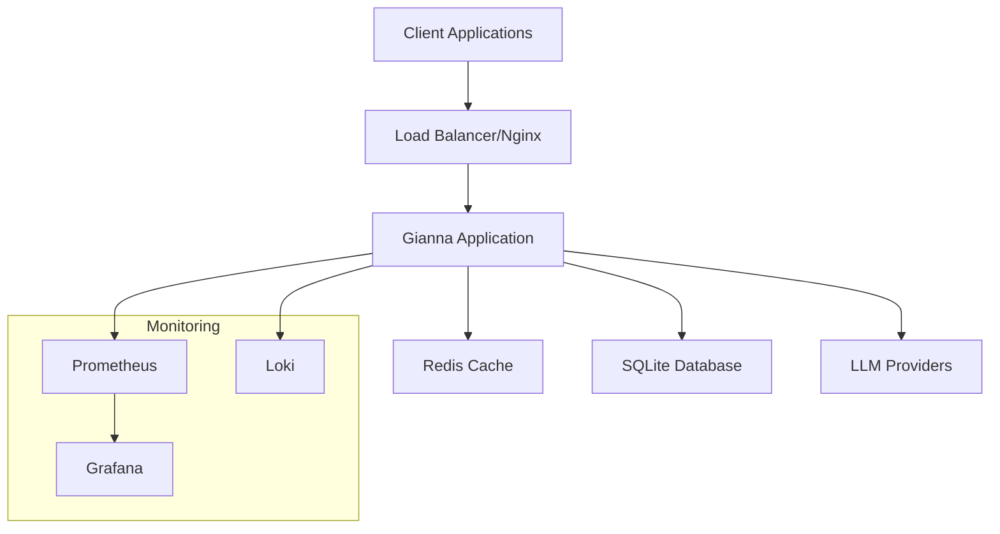

# Gianna Production Operations Guide

This guide provides comprehensive information for deploying, operating, and maintaining Gianna in production environments.

## Table of Contents

- [Quick Start](#quick-start)
- [Architecture Overview](#architecture-overview)
- [Deployment](#deployment)
- [Monitoring](#monitoring)
- [Security](#security)
- [Backup & Recovery](#backup--recovery)
- [Troubleshooting](#troubleshooting)
- [Maintenance](#maintenance)
- [Runbooks](#runbooks)

## Quick Start

### Prerequisites

- Docker and Docker Compose
- Python 3.11+
- Redis (for caching)
- Nginx (for reverse proxy)
- SSL certificates

### Minimum Hardware Requirements

| Environment | CPU | Memory | Storage | Network |
|-------------|-----|---------|---------|---------|
| Development | 2 cores | 4 GB | 20 GB | 100 Mbps |
| Staging | 4 cores | 8 GB | 50 GB | 1 Gbps |
| Production | 8 cores | 16 GB | 100 GB | 10 Gbps |

### Environment Setup

1. **Clone Repository**
   ```bash
   git clone https://github.com/your-org/gianna.git
   cd gianna
   ```

2. **Configure Environment**
   ```bash
   cp .env.example .env.production
   # Edit .env.production with your configuration
   ```

3. **Setup Secrets**
   ```bash
   cp config/production/secrets.yaml.example secrets/secrets.yaml
   # Add your API keys and secrets
   ```

4. **Deploy**
   ```bash
   ./scripts/deploy.sh -e production -s rolling
   ```

## Architecture Overview

### System Components



### Service Dependencies

- **Core Application**: Python 3.11, FastAPI/Flask
- **Cache Layer**: Redis 7+
- **Database**: SQLite (with backup to cloud storage)
- **Reverse Proxy**: Nginx
- **Monitoring**: Prometheus, Grafana, Loki
- **Container Runtime**: Docker + Docker Compose

## Deployment

### Deployment Strategies

#### Rolling Deployment (Default)
```bash
./scripts/deploy.sh -e production -s rolling
```
- Zero-downtime deployment
- Gradual replacement of instances
- Automatic rollback on failure

#### Blue-Green Deployment
```bash
./scripts/deploy.sh -e production -s blue-green
```
- Complete environment switch
- Fastest rollback capability
- Requires double resources

#### Canary Deployment
```bash
./scripts/deploy.sh -e production -s canary
```
- Gradual traffic shifting
- Risk mitigation
- Extended monitoring period

### Environment Configuration

| Environment | Purpose | Auto-Deploy | Monitoring |
|-------------|---------|-------------|------------|
| Development | Local development | Manual | Basic |
| Staging | Testing and QA | On develop branch | Full |
| Production | Live system | On release tag | Enterprise |

### Configuration Management

All configuration is managed through:
- Environment-specific YAML files in `config/production/`
- Encrypted secrets in `secrets/secrets.yaml`
- Environment variables in `.env.production`

## Monitoring

### Metrics Collection

**Prometheus Metrics**:
- Application performance (response time, throughput)
- LLM provider usage and costs
- Audio processing metrics
- Memory and learning system stats
- Cache hit rates and performance

**Custom Dashboards**:
- System overview
- LLM provider performance
- Audio processing analytics
- User interaction patterns
- Error tracking and alerting

### Health Checks

**Endpoints**:
- `/health` - Basic application health
- `/ready` - Readiness for traffic
- `/metrics` - Prometheus metrics

**Monitoring Script**:
```bash
./scripts/health_check.sh
```

### Alerting Rules

Critical alerts are configured for:
- Service downtime (>1 minute)
- High error rates (>5%)
- Memory usage (>80%)
- Disk space (>85%)
- LLM provider failures
- Cache performance degradation

## Security

### Production Security Checklist

- [ ] SSL/TLS certificates installed and configured
- [ ] API keys stored in encrypted secrets manager
- [ ] Rate limiting enabled on all endpoints
- [ ] Input validation active for all user inputs
- [ ] Regular security scans scheduled
- [ ] Dependency vulnerability monitoring
- [ ] Container security scanning
- [ ] Network segmentation implemented
- [ ] Backup encryption enabled
- [ ] Audit logging configured

### Security Features

**Input Validation**:
- SQL injection prevention
- XSS protection
- Path traversal prevention
- Command injection blocking

**Rate Limiting**:
- API endpoints: 100 requests/minute
- Authentication: 10 attempts/5 minutes
- LLM requests: 50 requests/minute
- File uploads: 10 uploads/5 minutes

**Authentication & Authorization**:
- JWT-based authentication
- Role-based access control
- Session management
- API key rotation

## Backup & Recovery

### Backup Strategy

**Automated Backups**:
- **Frequency**: Daily at 2 AM UTC
- **Retention**: 30 days local, 90 days cloud
- **Components**: Databases, configuration, secrets, application data

**Backup Command**:
```bash
./scripts/backup.sh backup --upload
```

### Recovery Procedures

**Full System Recovery**:
```bash
./scripts/backup.sh restore /path/to/backup.tar.gz
```

**Database Recovery**:
```bash
sqlite3 gianna_state.db ".restore '/path/to/backup/gianna_state.db'"
```

**Configuration Recovery**:
```bash
cp -r /path/to/backup/config/* ./config/
```

### Disaster Recovery Plan

1. **Assessment** (5 minutes)
   - Determine scope of failure
   - Identify recovery requirements

2. **Communication** (10 minutes)
   - Notify stakeholders
   - Update status page

3. **Recovery** (30-60 minutes)
   - Restore from backups
   - Verify system functionality
   - Resume normal operations

4. **Post-Incident** (24 hours)
   - Conduct retrospective
   - Update procedures
   - Implement preventive measures

## Troubleshooting

### Common Issues

#### Application Won't Start
```bash
# Check logs
docker-compose logs gianna

# Check configuration
./scripts/health_check.sh

# Verify dependencies
docker-compose ps
```

#### High Memory Usage
```bash
# Check memory metrics
curl http://localhost:8000/metrics | grep memory

# Restart application
docker-compose restart gianna

# Scale horizontally if needed
docker-compose up --scale gianna=3
```

#### LLM Provider Errors
```bash
# Check provider status
./scripts/health_check.sh detailed

# Verify API keys
python3 -c "from gianna.security import get_secrets_manager; sm = get_secrets_manager(); print(bool(sm.get_api_key('openai')))"

# Switch to backup provider
# Edit config/production/app.yaml
```

#### Cache Performance Issues
```bash
# Check Redis status
redis-cli ping

# Monitor cache metrics
curl http://localhost:8000/metrics | grep cache

# Clear cache if needed
redis-cli FLUSHALL
```

### Log Analysis

**Application Logs**:
```bash
# Real-time logs
docker-compose logs -f gianna

# Search for errors
grep -i error logs/gianna.log

# Filter by correlation ID
grep "correlation_id=abc123" logs/gianna.log
```

**System Metrics**:
```bash
# CPU and memory usage
top

# Disk usage
df -h

# Network connections
netstat -tulpn
```

## Maintenance

### Regular Maintenance Tasks

#### Daily
- [ ] Check system health status
- [ ] Review error logs and alerts
- [ ] Verify backup completion
- [ ] Monitor resource utilization

#### Weekly
- [ ] Update security patches
- [ ] Review performance metrics
- [ ] Clean up old log files
- [ ] Verify SSL certificate validity

#### Monthly
- [ ] Update dependencies
- [ ] Review and rotate API keys
- [ ] Test disaster recovery procedures
- [ ] Optimize database performance
- [ ] Review and update monitoring alerts

### Update Procedures

**Security Updates** (Critical):
```bash
# Pull latest security patches
git fetch origin
git checkout main
./scripts/deploy.sh -e production -s rolling
```

**Feature Updates**:
```bash
# Deploy via release process
git tag v1.2.0
git push origin v1.2.0
# Automated deployment via GitHub Actions
```

**Configuration Updates**:
```bash
# Edit configuration
vim config/production/app.yaml

# Apply changes
docker-compose restart gianna

# Verify changes
./scripts/health_check.sh
```

## Runbooks

### Service Restart

**When to use**: Memory leaks, configuration changes, minor issues

```bash
# Graceful restart
docker-compose restart gianna

# Force restart if needed
docker-compose down && docker-compose up -d

# Verify health
./scripts/health_check.sh
```

### Scale Up/Down

**Scale Up** (high traffic):
```bash
docker-compose up --scale gianna=3 -d
```

**Scale Down** (low traffic):
```bash
docker-compose up --scale gianna=1 -d
```

### Emergency Shutdown

**Immediate shutdown**:
```bash
docker-compose down
```

**Planned maintenance**:
```bash
# Put in maintenance mode
curl -X POST http://localhost:8000/admin/maintenance

# Wait for connections to drain
sleep 30

# Shutdown services
docker-compose down
```

### Performance Optimization

**Cache Optimization**:
```bash
# Clear cache
redis-cli FLUSHALL

# Restart with optimized settings
docker-compose restart redis
```

**Database Optimization**:
```bash
# Vacuum databases
sqlite3 gianna_state.db "VACUUM;"
sqlite3 gianna_optimization.db "VACUUM;"

# Reindex if needed
sqlite3 gianna_state.db "REINDEX;"
```

### Security Incident Response

1. **Immediate Response**
   ```bash
   # Block suspicious IPs
   iptables -A INPUT -s <suspicious_ip> -j DROP

   # Enable additional logging
   docker-compose restart gianna
   ```

2. **Investigation**
   ```bash
   # Check access logs
   grep <suspicious_activity> logs/nginx/access.log

   # Review security events
   grep "security_event" logs/gianna.log
   ```

3. **Recovery**
   ```bash
   # Rotate compromised secrets
   ./scripts/rotate_secrets.sh

   # Update security configurations
   vim config/production/app.yaml
   ```

## Support and Escalation

### Contact Information

- **On-call Engineer**: +1-555-0123
- **Security Team**: security@company.com
- **Operations Team**: ops@company.com
- **Slack Channels**: #gianna-ops, #security-alerts

### Escalation Matrix

| Severity | Response Time | Escalation |
|----------|---------------|------------|
| P0 (Critical) | 15 minutes | On-call + Manager |
| P1 (High) | 1 hour | On-call |
| P2 (Medium) | 4 hours | Next business day |
| P3 (Low) | 24 hours | Planned work |

### External Dependencies

- **LLM Providers**: OpenAI, Anthropic, Google
- **Cloud Storage**: AWS S3, Google Cloud Storage
- **CDN**: CloudFlare
- **DNS**: Route 53
- **Monitoring**: DataDog, New Relic
